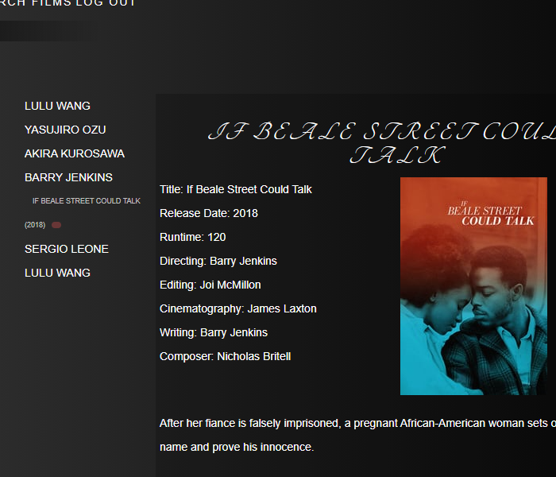

## Description
 This project is a webapp designed for users to create custom watch later lists that they can organize based off of Directors, Cinematographers, Editors, Writers & Composers.  Users can search via an API search, and add films to the app's connected database which will keep track of their lists.
 
## Screens

## Link
* https://cinephilesapp.herokuapp.com/

## Future Enhancements
* Create a watched list, to keep track of films the user has finished watching
* Streaming service options, displaying current streaming platforms that are showing the title
* Scroll through results & improve searching features
* Improve API responses, automate a greater number of user list creation steps
* Turn into a SPA.  Currently only the list show page functions as a SPA.

## Technologies Used
* MongoDB, Express, Node.js
* Javascript
* HTML
* CSS

* [Trello Board](https://trello.com/b/XiAC1KjD/cinephile)
* 
